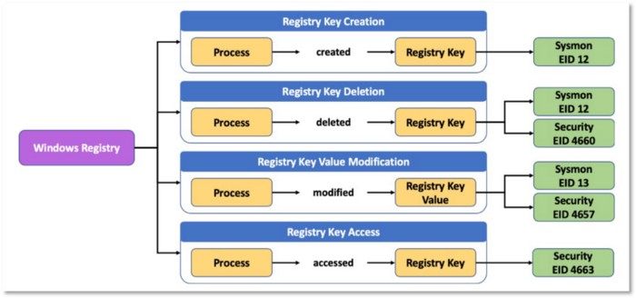

**Defining ATT&CK Data Sources, Part I: Enhancing the Current State**

# overview
+ We almost talk about TTPs(Tactcs, Techniques, Procedures) but there are Data Sources too which are important
+ They provide valuable data for us for detections
+ In these 2 posts we'll talk about new methodology for defineing our `data sources` (part 1) and `data source objects` (part 2)

	

 

# Where to Find Data Sources Today
+ Data sources are featured as part of the **(sub)technique** object properties:
+ Current structure contains only names of data sources
+ To understand and effectively apply these data sources we should align them with our technologies, logs, sensors.

	

# Improving the Current Data Sources in ATT&CK
+ Data sources as defined in [mitre philosiphy](https://attack.mitre.org/docs/ATTACK_Design_and_Philosophy_March_2020.pdf):
	+ Information collected by sensors or Logging systems that may be used to collect information about adversaries actions and their results
+ ATT&CK Data Sources provide a relation beween adversary actions and our analysis. This makes it a vital aspect when developing detection rules
+ Here is a Number of Sub-Techniques per data source which most of them are about process and file monitoring

	

## Develop Data Source Definitions
+ having definitions for data souces while contributing to data collection strategy developement enhances efficiency

	

## Standardize the Name Syntax
+ Data Sources can be interepretted differently. some are very specific like Windows Registery while others have wider scope

	

## Address Redundancy and Overlapping
+ Another unintended consequence of not having a standard naming structure for data sources is redundancy, which can also lead to overlaps.

# Examples
## example A: Loaded DLLs and DLL monitoring

Loaded DDL and DLL Monitoring. Are they same or different. They may have overlaps

	

	

## exmple B: Collecting process telemetry
+ Process Monitoring 
+ Process Command-Line Parameters
+ Process Use of Network

Can `Process Command-Line Parameters` be inside `Process Monitoring`. They have overlaps as well.

	

## Example C: Breaking down or aggregating Windows Event Logs

Data Sources such as `Windows Event Logs|` have wide variaty of scope and cover other data sources as well

	

+ ATT&CK recommends collecting events from data sources such as PowerShell Logs, Windows Event Reporting, WMI objects, and Windows Registry.
+ However, these could be already covered by `Windows Event Logs` as previously shown.
+ Do we group every Windows data source under `Windows Event Logs` or keep them all as independent data sources?

	

# Ensure Platform Consistency
+ Ensure platforms 
+ Sub-Techniques
+ [example1](https://attack.mitre.org/techniques/T1003/)) , [example2](_https://attack.mitre.org/techniques/T1003/001/)

	

# A Proposed Methodology to Update ATT&CK’s Data Sources
+ Need a methodology to describe data sources
+ 6 ideas to upgrade ATT&CK Data Sources

## 1. Leverage Data Modeling
+ Need to define a data model for data sources
+ ‌‌Better understanding and relations with other components
+ Here is an initial proposed data model for ATT&CK data sources

	

+ After defining Data Models for Data Sources we can specify relationships between sensors, logs and ...

	

## 2. Define Data Sources Through Data Elements

+ Define elements for data sources
+ For example `Windows Registry` includes `user`, `process` and `registry key`

	

+ Another example is for network traffic Data sources elements to be collected

	

## 3. Incorporate Data Modeling and Adversary Modeling

+ Relationship between Data sources and data elements and actions
+ It helps for better understanding the relationships between elements

	

## 4. Integrate Data Sources into ATT&CK as Objects

+ Date Sources need to be included in Tactics, Techniques and Groups diagram
+ While data sources have always been a property/field object of a technique, it’s time to convert them into objects, with their own corresponding properties.

	

## 5. Expand the ATT&CK Data Source Object
+ Once data sources are integrated as objects in the ATT&CK framework, and we establish a structured way to define data sources, we can start identifying additional information or metadata in the form of properties
+ The table below outlines some initial properties we propose starting off with

	

## 6. Extend Data Sources with Data Components
+ Our final proposal is to define data components.
+ The relationships between the data elements related to the data sources (e.g., Process, IP, File, Registry) can be grouped together and provide an additional sub-layer of context to data sources.
+ This concept was developed as part of the [Open Source Security Event Metadata (OSSEM)](https://github.com/OTRF/OSSEM) project and presented at ATT&CKcon 2018 and 2019.
+ We refer to this concept as **Data Components**.

	

Diagram shows how we can extend the Data Components based on our logs and needs

	

# What’s Next

In the second post of this two-part series, we’ll explore a methodology to help define new ATT&CK data source objects and how to implement the methodology with current data sources.

