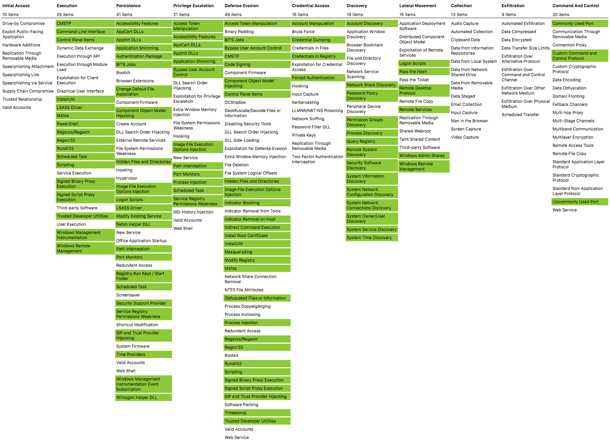

# Top most ATT&CK Techniques used in wild

## List

1. Command and Scripting Interpreter [T1059](https://attack.mitre.org/techniques/T1059/) 
	1. PowerShell [T1059.001](https://attack.mitre.org/techniques/T1059/001/)
	2. Windows Command Shell [T1059.003](https://attack.mitre.org/techniques/T1059/003/)
2. Signed Binary Proxy Execution [T1218](https://attack.mitre.org/techniques/T1218)
	1. Rundll32 [T1218.011](https://attack.mitre.org/techniques/T1218/011/)
	2. Mshta [T1218.005](https://attack.mitre.org/techniques/T1218/005/)
3. Create or Modify System Process [T1543](https://attack.mitre.org/techniques/T1543/)
	1. Windows Service [T1543.003](https://attack.mitre.org/techniques/T1543/003/)
4. Scheduled Task/Job [T1053](https://attack.mitre.org/techniques/T1053/)
	1. Scheduled Task [T1053.005](https://attack.mitre.org/techniques/T1053/005/)
5. OS Credential Dumping [T1003](https://attack.mitre.org/techniques/T1003/)
	1. LSASS Memory [T1003.001](https://attack.mitre.org/techniques/T1003/001/)
6. Process Injection [T1055](https://attack.mitre.org/techniques/T1055/)
7. Obfuscated Files or Information [T1027](https://attack.mitre.org/techniques/T1027/)
8. Ingress Tool Transfer [T1105](https://attack.mitre.org/techniques/T1105/)
9. System Services [T1569](https://attack.mitre.org/techniques/T1569/)
	1. Service Execution [T1569.002](https://attack.mitre.org/techniques/T1569/002/)
10. Masquerading [T1569](https://attack.mitre.org/techniques/T1569/)
	1. Rename System Utilities [T1036.003](https://attack.mitre.org/techniques/T1036/003/)

  

## Table

|Percentage|Technique|Sub-Techniques|Tactic|Link|
|:---------|:-----|:-------|:-------------|:---|
|24%|Command and Scripting Interpreter [T1059](https://attack.mitre.org/techniques/T1059/)|PowerShell [T1059.001](https://attack.mitre.org/techniques/T1059/001/) Windows Command Shell [T1059.003](https://attack.mitre.org/techniques/T1059/003/)|Execution [TA0005](https://attack.mitre.org/tactics/TA0002)|[redcanary](https://redcanary.com/threat-detection-report/techniques/command-scripting-interpreter/)|
|19%|Signed Binary Proxy Execution [T1218](https://attack.mitre.org/techniques/T1218)|Rundll32 [T1218.011](https://attack.mitre.org/techniques/T1218/011/) Mshta [T1218.005](https://attack.mitre.org/techniques/T1218/005/)|Defense Evasion [TA0005](https://attack.mitre.org/tactics/TA0005)|[redcanary](https://redcanary.com/threat-detection-report/techniques/command-scripting-interpreter/)|
|16%|Create or Modify System Process [T1543](https://attack.mitre.org/techniques/T1543/)|Windows Service [T1543.003](https://attack.mitre.org/techniques/T1543/003/)|Persistence [TA0003](https://attack.mitre.org/tactics/TA0003) Privilege Escalation [TA0004](https://attack.mitre.org/tactics/TA0004)|[redcanary](https://redcanary.com/threat-detection-report/techniques/command-scripting-interpreter/)|
|16%|Scheduled Task/Job [T1053](https://attack.mitre.org/techniques/T1053/)|Scheduled Task [T1053.005](https://attack.mitre.org/techniques/T1053/005/)|Execution [TA0002](https://attack.mitre.org/tactics/TA0002) Privilege Escalation[TA0004](https://attack.mitre.org/tactics/TA0004)|[redcanary](https://redcanary.com/threat-detection-report/techniques/command-scripting-interpreter/)|
|7% |OS Credential Dumping [T1003](https://attack.mitre.org/techniques/T1003/)|LSASS Memory [T1003.001](https://attack.mitre.org/techniques/T1003/001/)|Credential Access [TA0006](https://attack.mitre.org/tactics/TA0006)|[redcanary](https://redcanary.com/threat-detection-report/techniques/command-scripting-interpreter/)|
|7% |Process Injection [T1055](https://attack.mitre.org/techniques/T1055/)|ALL|Privilege Escalation [TA0004](https://attack.mitre.org/tactics/TA0004) Defense Evasion [TA0005](https://attack.mitre.org/tactics/TA0005)|[redcanary](https://redcanary.com/threat-detection-report/techniques/command-scripting-interpreter/)|
|6% |Obfuscated Files or Information [T1027](https://attack.mitre.org/techniques/T1027/)|ALL|Defense Evasion [TA0005](https://attack.mitre.org/tactics/TA0005)|[redcanary](https://redcanary.com/threat-detection-report/techniques/command-scripting-interpreter/)|
|5% |Ingress Tool Transfer [T1105](https://attack.mitre.org/techniques/T1105/)|ALL|Command and Control [TA0011](https://attack.mitre.org/tactics/TA0011)|[redcanary](https://redcanary.com/threat-detection-report/techniques/command-scripting-interpreter/)|
|4% |System Services [T1569](https://attack.mitre.org/techniques/T1569/)|Service Execution [T1569.002](https://attack.mitre.org/techniques/T1569/002/)|Execution [TA0002](https://attack.mitre.org/tactics/TA0002)|[redcanary](https://redcanary.com/threat-detection-report/techniques/command-scripting-interpreter/)|
|4% |Masquerading [T1569](https://attack.mitre.org/techniques/T1569/)|Rename System Utilities [T1036.003](https://attack.mitre.org/techniques/T1036/003/)|Defense Evasion [TA0005](https://attack.mitre.org/tactics/TA0005)|[redcanary](https://redcanary.com/threat-detection-report/techniques/command-scripting-interpreter/)|

[Reference](https://redcanary.com/threat-detection-report/techniques/)

	

# ATT&CK Coverage with Sysmon

https://github.com/olafhartong/sysmon-modular/

	

